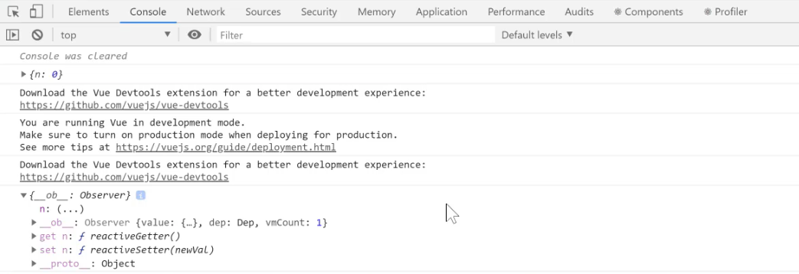
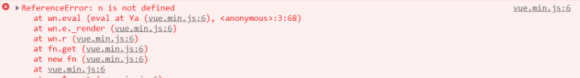

# 浅析 VUE 数据响应式


##  什么是响应式

Vue 最独特的特性之一，是其非侵入性的响应式系统。数据模型仅仅是普通的 JavaScript 对象。而当你修改它们时，视图会进行更新。这使得状态管理非常简单直接<b>，不过理解其工作原理同样重要。</b>


###  * Vue的数据存储在data里，当数据更新时，会触发视图的渲染。

首先先来看一下Vue到底对data做了什么。

```
//引用完整版 Vue
import Vue from "vue/dist/vue.js"; 

Vue.config.productionTip = false;  //禁用警告

const myData = {
  n: 0
}
console.log(myData)  // 精髓

let vm = new Vue({
  data: myData,
  template: `
    <div>{{n}}</div>
  `
}).$mount("#app");

setTimeout(()=>{
  myData.n += 10
console.log(myData)  // 精髓
},3000)
```
打印结果



在这里,第一个 n 是 0,但是第二个在 3s后返回的却不是 n是10 ,两次的结果不一样,那就说明 vue对 data 里的数据进行了处理

### Vue对myData做了什么?

1 给对象添加value属性，添加getter 和 setter 对属性进行监控

2 使用vm作为myData的代理

３ 会对myData的所有属性进行监控，当vm知道myData属性变了，就可以调用render(data)进行渲染了。

## 小结 数据响应式
const vm = new Vue({ data: { n: 0 } })

如果我修改vm.n，那么UI中的n就会响应我

(Vue 2通过Object.defineProperty来实现数据响应式)

## vue 有 bug

### Object.defineProprety 的问题

Object.defineProprety(obj, 'n' ,{..})必须要有一个 'n',才能监听和代理 obj.n,<b>那如果我们没有给出 n呢？</b>
##### 示例一：
```
import Vue from "vue/dist/vue.js";

Vue.config.productionTip = false;

new Vue({
  data: {},
  template: `
    <div>{{n}}</div>
  `
}).$mount("#app");
```
结果 vue 报出警告


##### 示例二：
```
import Vue from "vue/dist/vue.js";

Vue.config.productionTip = false;

new Vue({
  data: {
    obj: {
      a: 0 // obj.a 会被 Vue 监听 & 代理
    }
  },
  template: `
    <div>
      {{obj.b}}
      <button @click="setB">set b</button>
    </div>
  `,
  methods: {
    setB() {
      this.obj.b = 1; 
    }
  }
}).$mount("#app");
```
##### 点击setB后，页面会显示1吗？

答案是：不会，因为Vue无法监听一开始就不存在的obj.b

#### 解决方法一
    一开始就声明好所有的 key
```
new Vue(){
    data:{
        obj:{
            a:'0';
            b:'';
        }
    }
}
```
#### 解决方法二
    使用Vue.set 或 this.$set
```
methods:{
    setB(){
        Vue.set(this.obj,'b',1)//或 this.$set(this.obj,'b',1)
    }
}
```
### * 重点
由于Object.definePropery 的限制，Vue无法检测到对象属性的添加或删除。所以Vue不允许动态添加根级响应式属性，所以你必须在初始化实例前声明所有根级响应式属性，哪怕只是一个空值，或者使用Vue.set 或 vm.$set 进行设置。
### 当data是数组时：
请看示例
```
import Vue from "vue/dist/vue.js";

Vue.config.productionTip = false;

new Vue({
  data: {
    array: ["a", "b", "c"]
  },
  template: `
    <div>
      {{array}}
      <button @click="setD">set d</button>
    </div>
  `,
  methods: {
    setD() {
      this.array[3] = "d"; //请问，页面中会显示 'd' 吗？
      // 等下，你为什么不用 this.array.push('d')
    }
  }
}).$mount("#app");
```
如果data时数组，意味着你无法提前声明所有key，也不可以一直使用Vue.set 或 vm.$set 进行设置。

尤雨溪的做法是，篡改数组的API，我们可以使用Vue提供的变异方法操作，如下

this.array.push('value')
这里使用的push并不是Array.push，而是经过vue篡改后的api，vue的data中的数组会增加一层原型，实现了对数组数据的监听和代理，从而触发视图的更新。在Vue中这种api称为变异方法。这7个变异方法包括：

*push()

*pop()

*shift()

*unshift()

*splice()

*sort()

*reverse()


> 编辑于 2-16-2020